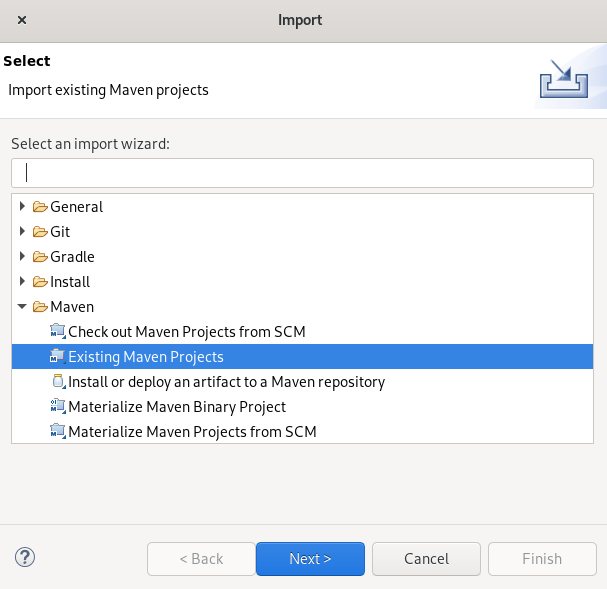

## 下载代码
```bash
git clone http://github.com/dyrnq/mhgoi-blog
```


## Eclipse导入项目




## 运行

### 选择一main函数启动
main函数运行`net.mhgoi.blog.MainApplication.java`


### 选择二mvnw启动

```bash
cd mhgoi-blog/backend
./mvnw --projects api spring-boot:run --settings ${MAVEN_HOME}/conf/settings.xml
```
或者

```bash
cd mhgoi-blog/backend/api
../mvnw spring-boot:run --settings ${MAVEN_HOME}/conf/settings.xml
```


### 选择三maven启动

```bash
cd mhgoi-blog/backend/api
mvn spring-boot:run
```


## 打包


```bash
cd mhgoi-blog/backend
./mvnw clean package -DskipTests=true --settings ${MAVEN_HOME}/conf/settings.xml
```


```bash
mkdir -p ~/.m2/
ln -s ${MAVEN_HOME}/conf/settings.xml ~/.m2/settings.xml
```
