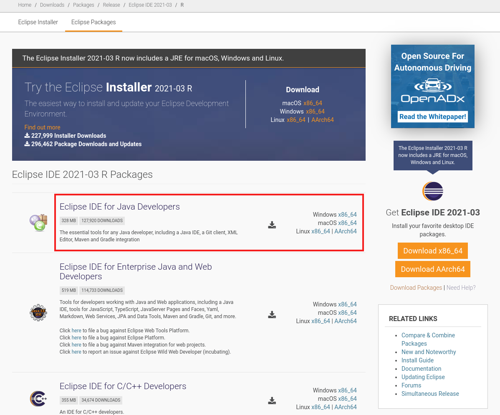
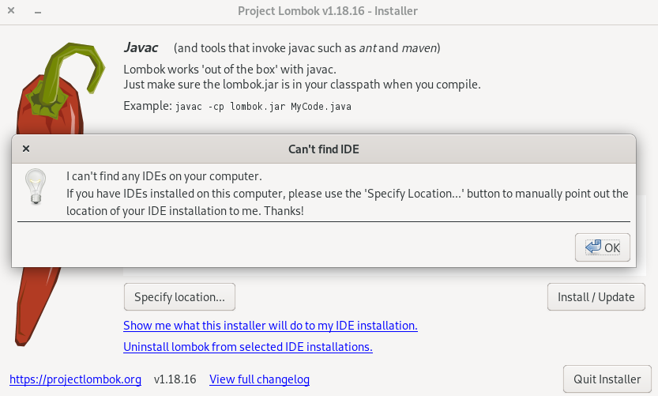
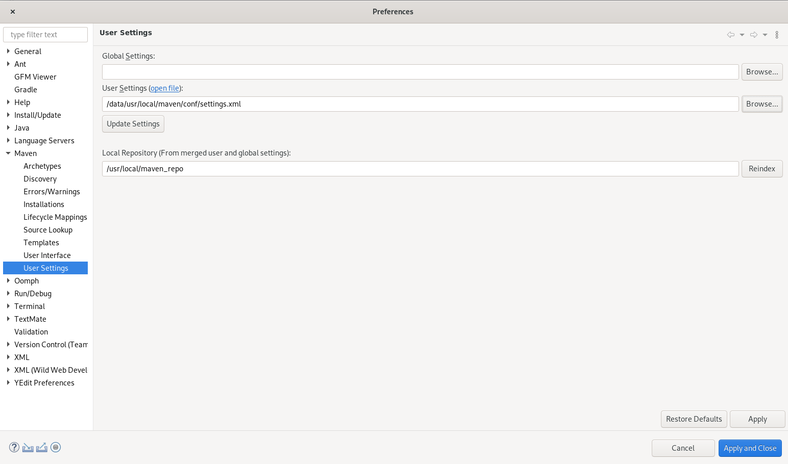

# Eclipse

## 下载Eclipse

从[https://www.eclipse.org/downloads/packages/](https://www.eclipse.org/downloads/packages/)下载`Eclipse IDE for Java Developers`




## 下载lombok

从[https://projectlombok.org/download](https://projectlombok.org/download)下载lombok.jar

然后执行

```bash
java -jar lombok.jar
```


如果提示`Can't find IDE`,则需要选择手工选择Eclipse的安装路径(上图的Specify location)，再点击install！

## 配置maven

这一步是统一命令行(shell)中使用mvn和Eclipse中maven使用相同的设置

