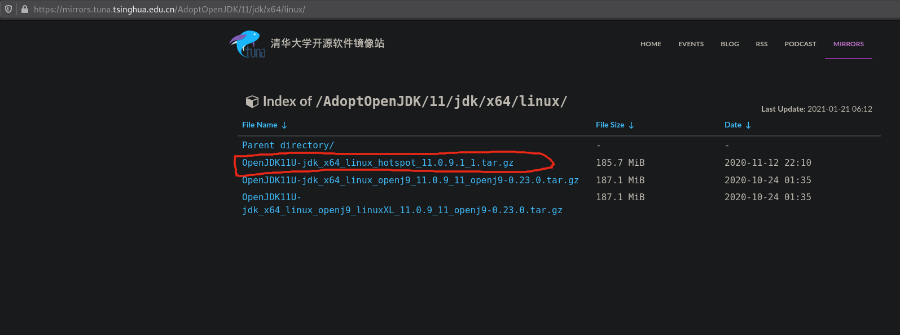

# AdoptOpenJDK


从[https://adoptopenjdk.net/](https://adoptopenjdk.net/)下载AdoptOpenJDK。也可以从清华TUNA镜像下载，根据自己的平台选择下载jdk

* [https://mirrors.tuna.tsinghua.edu.cn/AdoptOpenJDK/11/jdk/x64/linux/](https://mirrors.tuna.tsinghua.edu.cn/AdoptOpenJDK/11/jdk/x64/linux/)
* [https://mirrors.tuna.tsinghua.edu.cn/AdoptOpenJDK/11/jdk/x64/mac/](https://mirrors.tuna.tsinghua.edu.cn/AdoptOpenJDK/11/jdk/x64/mac/)
* [https://mirrors.tuna.tsinghua.edu.cn/AdoptOpenJDK/11/jdk/x64/windows/](https://mirrors.tuna.tsinghua.edu.cn/AdoptOpenJDK/11/jdk/x64/windows/)

下载解压缩后,配置好JAVA_HOME和PATH变量，然后执行`java -version`查看java版本


```bash
jim@debian:~$ java -version
openjdk version "11.0.9.1" 2020-11-04
OpenJDK Runtime Environment AdoptOpenJDK (build 11.0.9.1+1)
OpenJDK 64-Bit Server VM AdoptOpenJDK (build 11.0.9.1+1, mixed mode)
```


