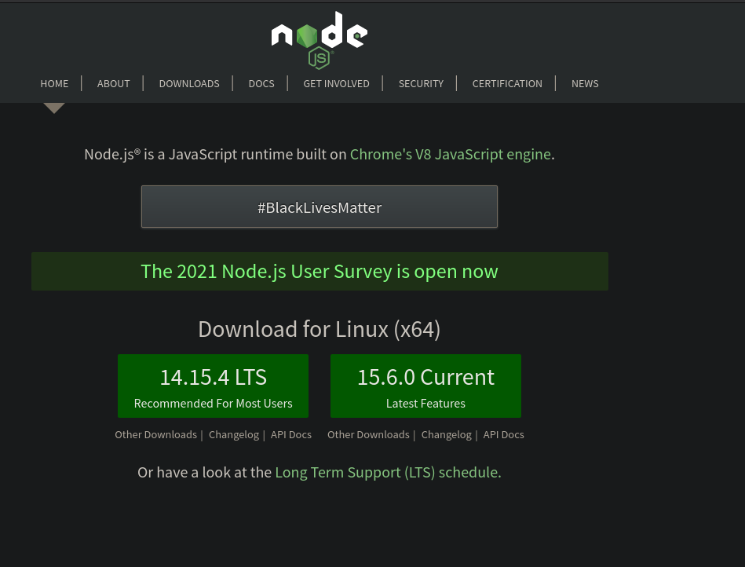

## 下载nodejs

从[https://nodejs.org/](https://nodejs.org/)下载nodejs



下载解压缩后,配置好NODE_HOME和PATH变量，然后执行`node --version`查看java版本


```bash
jim@debian:~$ node --version
v14.15.4
jim@debian:~$ npm --version
6.14.10
```

## 设置npm的mirror

```bash
npm config set registry https://mirrors.huaweicloud.com/repository/npm/
npm cache clean -f
```

## 其他方式安装

- [https://sdkman.io/](https://sdkman.io/)
- [https://github.com/nvm-sh/nvm](https://github.com/nvm-sh/nvm)
- [https://github.com/mklement0/n-install](https://github.com/mklement0/n-install)
- [https://mirrors.tuna.tsinghua.edu.cn/nodejs-release/v14.15.4/](https://mirrors.tuna.tsinghua.edu.cn/nodejs-release/v14.15.4/)