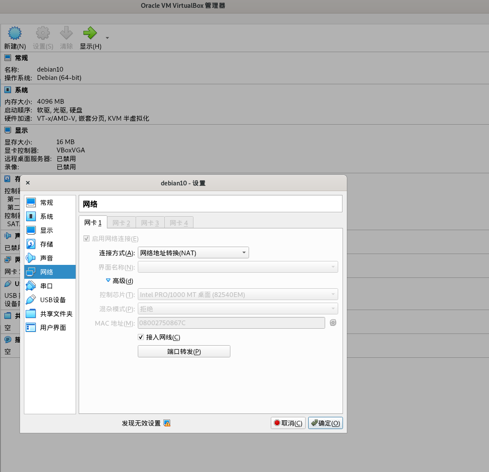
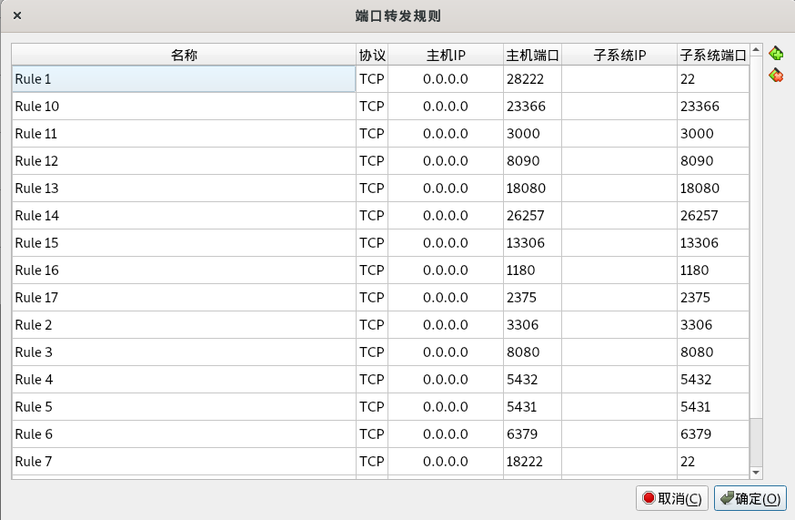

# vm-nat网络配置

在使用vm作为开发测试机的时候首先碰到的问题，就是部署在虚拟机里的服务，比如mysql，怎样在host主机访问呢？

首先整理下概念

* Host：宿主机
* Guest: 虚机

这里记录下我的NAT方法


打开VirtualBox中的这台虚机-->设置-->网络-->高级-->端口转发






其中每一行是一个端口映射，主机IP固定写0.0.0.0，子系统IP不用写。主机端口写映射到主机的端口，子系统端口写虚机要映射出来的端口。

比如要映射虚拟机的22端口到宿主机，这里由于宿主机的22端口被宿主机的sshd占用了，所以这里不能再用22端口映射，所以改成了18222

| 主机IP  | 主机IP | 子系统IP | 子系统端口 |
|---------|--------|----------|------------|
| 0.0.0.0 | 18222  |          | 22         |


这样在宿主机上通过`ssh tom@127.0.0.1 -p 18222` 这条命令就连到虚拟机的ssh了。

以此类推，其他3306、6379等端口也可以从虚拟机映射到宿主机，如果宿主机已经占用了端口那么就改个未被占用的端口，自行记录对应关系。

# docker容器端口映射

以此类推，如果在vm中起docker容器，首先要把容器的端口映射出来。

```bash
docker run -d --name mysql57 --restart always -p 3306:3306 mysql:5.7.32
```
比如这句mysql容器，首先把容器3306端口映射到容器的宿主机(vm)，然后再把vm的3306映射到vm的宿主机。

这样通过两层网络转发，就可以在宿主机直接访问容器的3306数据库了。